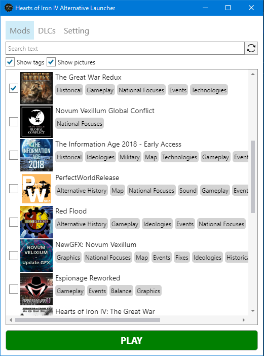
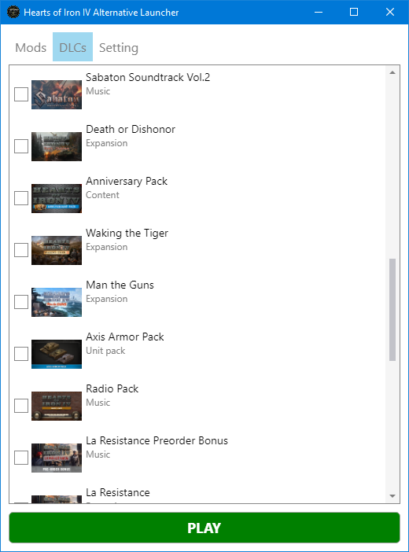

# Hearts of Iron IV Alternative launcher

This is a custom launcher for Hearts of Iron IV that offers faster loading times compared to the official Paradox Launcher, and includes images for list of mods and DLCs for a more visual browsing experience.

## Features
- Faster loading times compared to the official Paradox Launcher
- Displays mod images for easier identification and selection
- Simple and easy to use interface
- Supports Windows and macOS

Installing mods from the workshop currently is not supported.

## Sсreenshots

## Installation
1. Download latest from [releases](https://github.com/Zeon8/HOI4Launcher/releases/)
2. Extract the files to a folder on your computer
3. Run the `HOI4Launcher.exe` file to start the launcher

## Usage
1. If you are launching for the first time, specify the path to the game.
2. Choose mods and DLCs from the list that you want to play with
3. Click the "PLAY" button to start the game with the selected options.

## Dependencies
- [AvaloniaUI](https://avaloniaui.net/) — A cross-platform UI framework for .NET
- [MessageBox.Avalonia](https://github.com/AvaloniaCommunity/MessageBox.Avalonia) — Messagebox for AvaloniaUI
- [Game icon](https://www.reddit.com/r/hoi4/comments/85l962/new_game_icon_made_by_me_the_original_sucks_free/) made by [tudor088](https://www.reddit.com/user/tudor088/)

## License
This HOI4Launcher is licensed under the [GNU GPL v3.0](LICENSE.md).